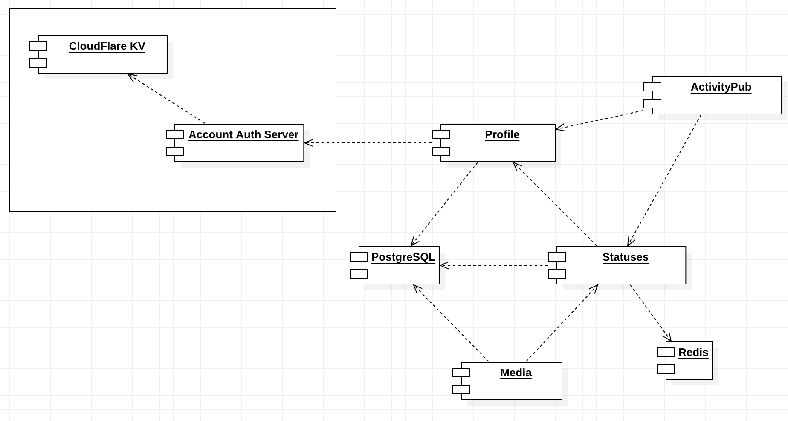

# ActivityPub 기반 분산 소셜 네트워크 서비스

# 1. 서론

일론 머스크가 트위터를 인수한 후, 다른 SNS로 이동하는 사용자들이 증가하고 있습니다. 특히, ActivityPub 프로토콜을 기반으로 하는 Mastodon이나 Misskey와 같은 소셜 네트워크 서비스로 이동하는 사용자가 많아졌으며, Facebook을 운영하는 Meta도 ActivityPub 기반의 소셜 네트워크 제작을 발표하며 성장 가능성이 높다는 것을 보여주고 있습니다.

현재 우리는 Mastodon 서버를 운영하고 있지만, Mastodon 소프트웨어는 비상업용이며, 오래된 Ruby on Rails 코드 베이스로 인해 기능 확장에 적합하지 않은 구조를 가지고 있습니다. 이러한 문제를 해결하기 위해 TypeScript 기반으로 코드를 작성하고, 모듈 구조를 채택하여 확장성이 높은 소셜 네트워크 서비스를 구현하고 사업화할 것입니다.

# 2. 관련연구

## 2.1. ActivityPub

ActivityPub은 분산 소셜 네트워크에서 상호작용하는데 사용되는 오픈 프로토콜입니다. 이를 통해 사용자는 여러 서버에서 호스팅되는 컨텐츠와 상호작용할 수 있습니다. 예를 들어, 사용자가 다른 사용자와 대화를 나누거나, 글을 작성하거나, 좋아요를 누르거나, 팔로우를 할 수 있습니다.

ActivityPub은 트위터, 페이스북 등의 중앙집중형 소셜 네트워크와는 다르게, 분산 소셜 네트워크에서의 자유로운 정보 공유와 상호작용을 가능하게 합니다. 이는 사용자가 자신이 속한 네트워크 외의 다른 네트워크에도 연결되어 다양한 사용자와 상호작용할 수 있게 해줍니다.

ActivityPub은 Mastodon, Misskey, Pleroma와 같은 분산 소셜 네트워크 서비스에서 사용되고 있습니다. 이러한 서비스들은 ActivityPub 프로토콜을 기반으로 하여 사용자들이 서로 상호작용하고 컨텐츠를 공유할 수 있도록 해주고 있습니다.

## 2.2. Mastodon

Mastodon은 ActivityPub 프로토콜을 기반으로 하는 분산 소셜 네트워크 서비스입니다. 중앙집중형 소셜 네트워크와는 달리, 사용자는 여러 Mastodon 서버 중 하나를 선택하여 컨텐츠를 호스팅할 수 있습니다. 또한, Mastodon은 트위터와 유사한 인터페이스를 제공하며, 사용자가 글을 작성하거나, 대화를 나눌 수 있도록 해줍니다.

한국어권에서는 twingyeo.kr, Planet, Qdon 등의 마스토돈 서버들이 운영되고 있으며, 최근 일론 머스크가 인수한 트위터의 대안으로 떠오르고 있습니다.

## 2.3. 기존 연구의 문제점 및 해결 방안

### 2.3.1. 연구의 문제점

Mastodon은 비상업용 소프트웨어로, 오래된 Ruby on Rails 코드 베이스를 사용하고 있어 기능 확장이 적합하지 않은 구조를 가지고 있습니다. 또한, 사용자 경험이 중요한 소셜 네트워크 서비스에서는 사용자 인터페이스의 디자인과 사용성이 매우 중요한데, Mastodon은 이 측면에서도 아쉬운 부분이 많습니다.

### 2.3.2. 해결 방안

이번 연구에서는 TypeScript 기반으로 코드를 작성하고, 모듈 구조를 채택하여 확장성이 높은 소셜 네트워크 서비스를 구현하고 사업화할 것입니다. 이를 통해 기능 확장이 쉬운 서비스를 만들고, 사용자 경험을 고려해서 인터페이스를 디자인할 것입니다.

# 3.  프로젝트 내용

## 3.1.  시나리오

- 사용자는 회원가입을 통해 서비스를 이용할 수 있습니다.
- 사용자는 글을 작성하거나, 이미지나 동영상 등의 콘텐츠를 업로드할 수 있습니다.
- 사용자는 다른 사용자를 팔로우하거나, 다른 사용자로부터 팔로우를 받을 수 있습니다.
- 사용자는 다른 사용자와 대화를 나눌 수 있습니다.
- 사용자는 글에 댓글을 달거나, 좋아요를 누를 수 있습니다.
- 사용자는 자신이 작성한 글이나 업로드한 콘텐츠를 수정하거나 삭제할 수 있습니다.
- 사용자는 자신의 프로필을 설정하거나, 다른 사용자의 프로필을 확인할 수 있습니다.
- 사용자는 검색 기능을 통해 다른 사용자나 콘텐츠를 찾을 수 있습니다.
- 모듈형 구조로 작성되어, 추후 기능을 추가하거나 수정하기 쉬워야 한다.

## **3.2. 요구사항**

### **3.2.1. 시나리오에 기반한 사용자 요구사항**

사용자는 회원가입을 할 수 있어야 한다.

사용자는 로그인 후, 글을 작성하거나, 이미지나 동영상 등의 콘텐츠를 업로드할 수 있어야 한다.

사용자는 다른 사용자를 팔로우하거나, 다른 사용자로부터 팔로우를 받을 수 있어야 한다.

사용자는 다른 사용자와 대화를 나눌 수 있어야 한다.

사용자는 글에 댓글을 달거나, 좋아요를 누를 수 있어야 한다.

사용자는 자신이 작성한 글이나 업로드한 콘텐츠를 수정하거나 삭제할 수 있어야 한다.

사용자는 자신의 프로필을 설정하거나, 다른 사용자의 프로필을 확인할 수 있어야 한다.

사용자는 검색 기능을 통해 다른 사용자나 콘텐츠를 찾을 수 있어야 한다.

### **3.2.2. 프로젝트 아키텍쳐 상 요구사항**

코드는 TypeScript로 작성되어야 한다.

모듈형 구조로 작성되어, 추후 기능을 추가하거나 수정하기 쉬워야 한다.

## 3.3. 시스템 설계

### 3.3.1. 시스템 구성도

### 3.3.2. Activity Diagram

### 3.3.3. Sequence Diagram

# **4. 프로젝트 결과**

## 4.1. 연구 결과

이번 프로젝트의 중점 사항은 현재 운영되고 있는 Mastodon 서버를 이용하고 있는 사용자들과 신규로 Twitter에서 이전해오는 사용자 모두가 쉽게 적응할 수 있는 UX를 구현하는 것입니다. 그와 더불어 Ruby on Rails 기반의 오래된 코드베이스에서 벗어나 확장하기 쉬운 구조를 구축하는 것도 중요합니다. 

### 4.1.1. TypeScript + Nest.js + React 코드베이스

Mastodon은 백엔드가 Ruby on Rails, 프론트엔드가 React로 구현되어 있습니다. 백엔드와 프론트엔드가 사용하는 언어가 달라 같은 정의를 따로따로 구현하고, 그 과정에서 한쪽의 변경 누락으로 인해 유지보수상 문제가 발생하기도 했습니다. 이 프로젝트에서는 백엔드와 프론트엔드의 사용 언어를 TypeScript로 통일하고, 백엔드에 Nest.js를 도입해 모듈화된 구현으로 기능 추가가 쉽도록 개발했습니다.

### 4.1.2. Single-sign on(SSO) 구현

기존의 ActivityPub 구현체 소프트웨어는 계정 정보를 소프트웨어 자체에서 관리했습니다. 이는 구현이 간단하다는 이점이 있으나, SNS 서비스뿐만 아니라 같은 계정을 이용하는 다른 서비스를 구축하기에는 부적절한 면이 있었습니다. 따라서 이 프로젝트에서는 SNS 서비스를 제공하는 서버와 계정 인증 서버를 분리하여, 향후에 SNS 서비스뿐만 아니라 다른 서비스를 구축할 때도 쉽게 계정을 공유할 수 있도록 개발했습니다.

# 5. 결론

## 5.1. 기대효과

이 프로젝트를 통해, ActivityPub 기반 분산 소셜 네트워크 서비스를 구현하고 사업화할 것입니다. 이를 통해 사용자들은 기존 중앙집중형 소셜 네트워크와는 다른 분산 소셜 네트워크를 경험할 수 있으며, 높은 확장성과 사용성을 가진 서비스를 이용할 수 있을 것입니다.

## 5.2. 추후 연구 방향

SNS 사용자들에 대한 의견 청취 결과, 사용자들이 Twitter 등의 기존 SNS에서 옮기려고 하지 않는 가장 큰 이유는 기존 SNS에서 사용자들이 구축했던 팔로워와 타임라인을 새로운 SNS에서는 찾을 수 없음입니다. 따라서 ActivityPub뿐만 아니라 Twitter나 Bluesky 등의 타 SNS와도 API를 통해 게시물을 가져옴으로써, 사용자가 기존의 SNS에서 얻을 수 있던 경험을 그대로 옮겨올 수 있도록 해서 새로운 사용자들의 적응을 좀 더 쉽게 할 수 있게 한다면 좋을 것 같습니다.